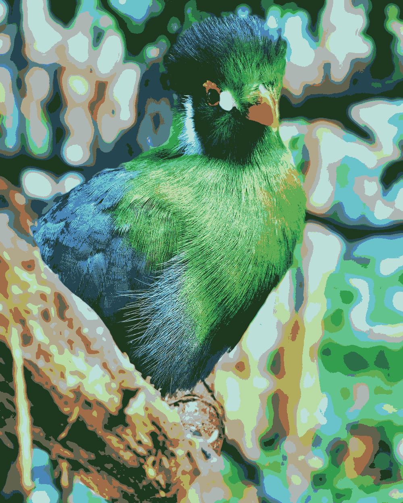
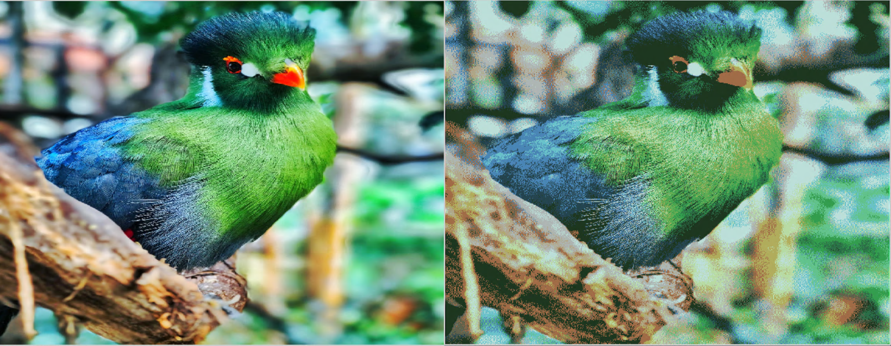
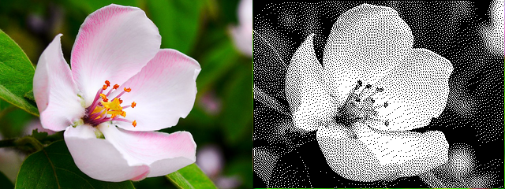
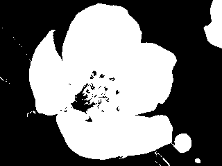

# Image-Processing
Various image manipulation algorithms including the popular Floyd-Steinberg dithering.

Applying only the median cut algorithm:

Applying median cut + Floyd-Steinberg dithering(the image on the left is the original image):

The image on the left above uses some 400,000 unique color values and the dithered image on the right uses only 16(median cut and FS 
dithering magic!)

Let us do some bitmap conversions now.

Original image and Bitmap image(no median cut this time, only 2 colors used):

Same image if no dithering was applied(no error diffusion at all):

